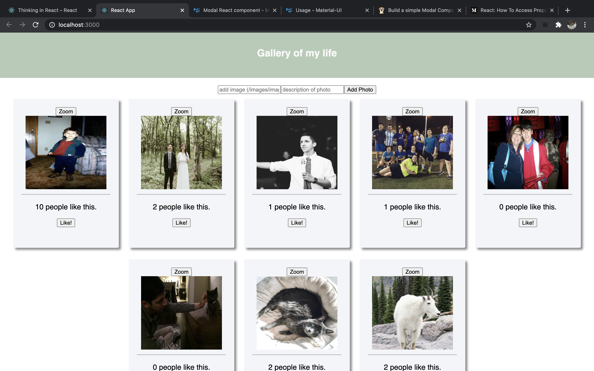

# GALLERY OF MY LIFE - WEEKEND CHALLENGE #4

## Description

Duration: 48 Hour Challenge

Description:

An interactive gallery display which showcases not only moments from my life (so you can get to know me a little better), but also the interactivity of such a display.

The photographs are interactable, displaying short descriptions to give insight on the important moments, and if you like what you see and read, give it a like!

<!-- To see the fully functional site, please visit: [DEPLOYED VERSION OF APP](www.heroku.com) -->

## Screen Shot

### Prerequisites

Link to software that is required to install the app (e.g. node).

- [React.js](https://reactjs.org)
- [Node.js](https://nodejs.org/en/)
- [PostgreSQL](https://www.postgresql.org)
-

## Installation

1. Create a database named `gallery`,
2. The queries in the `database.sql` file are set up to create all the necessary tables and populate the needed data to allow the application to run correctly. The project is built on [Postgres](https://www.postgresql.org/download/), so you will need to make sure to have that installed. We recommend using Postico to run those queries as that was used to create the queries,
3. Open up your editor of choice and run an `npm install`
4. Run `npm run server` in your terminal
5. Run `npm run client` in your terminal
6. The `npm run client` command will open up a new browser tab for you!

## Usage

1. Load up the application and begin exploring!
2. Listed are gallery items for you to view and find descriptions pertaining to their photo.
3. If you like the photo, drop a like on it! Your likes will add up with the viewers like you!

## Built With

List technologies and frameworks here

## Acknowledgement

Thanks to [Prime Digital Academy](www.primeacademy.io) who equipped and helped me to make this application a reality.

## Support

If you have suggestions or issues, please email me at [youremail@whatever.com](www.google.com)
